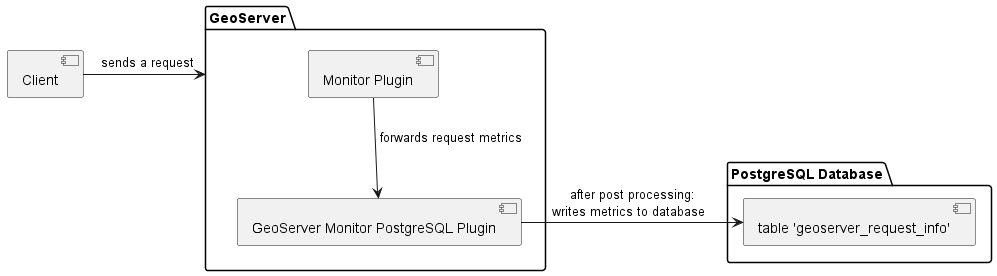

# GeoServer Monitor PostgreSQL Plugin

The GeoServer Monitor PostgreSQL Plugin is an extension to the official [Monitor Plugin](https://docs.geoserver.org/latest/en/user/extensions/monitoring/index.html) of GeoServer. It fetches the metrics from the Monitor Plugin and persists them in a PostgreSQL database. 

**Authors**: 
based on [CRediT (Contributor Roles Taxonomy)](https://credit.niso.org/)
| Name, ORCID and affiliation | Contributor Role(s) | Email |
| -- | -- | -- |
| [Sangeetha Shankar](https://orcid.org/0000-0003-0387-7740), DLR Institute of Transportation Systems | Conceptualization, Data curation, Formal Analysis, Investigation, Methodology, Resources, Software, Validation, Visualisation, Writing - original draft, Writing - review and editing | Sangeetha.Shankar@dlr.de |
| [Lucas Andreas Schubert](https://orcid.org/0000-0002-5516-5326), DLR Institute of Transportation Systems | Funding acquisition, Project administration, Resources, Supervision | Lucas.Schubert@dlr.de |

**Version**: 1.0.2 (05 January 2024)

## Purpose of the plugin

The [official Monitor Plugin](https://docs.geoserver.org/latest/en/user/extensions/monitoring/index.html) of the GeoServer allows only one method of storing the metrics on the requests received by the GeoServer - memory storage. This storage is volatile and information is lost when the GeoServer is restarted. Furthermore, it stores metrics only for the latest 100 requests. This is insufficient for GeoServers in productive environments receiving hundreds of requests everyday.  

The GeoServer Monitor PostgreSQL plugin aims to overcome this limitation by persisting the metrics in a PostgreSQL database. The persistent storage of metrics enables the administrators of the GeoServer to analyze the performance of their GeoServer layers and optimize their services.

## Prerequisites

1. [GeoServer](https://geoserver.org/download/)
2. [Monitor Plugin](https://docs.geoserver.org/latest/en/user/extensions/monitoring/index.html)

Note: The plugin has been tested with the following versions of GeoServer - 2.19.0, 2.21.2, 2.23.4 and in Ubuntu Server operating system.

## Building and installing the plugin

1. Clone the repository 
2. In `pom.xml` present in `monitor-psql folder`, change the GeoServer and GeoTools version to match those of your GeoServer instance.
3. Build the JAR file using a software of your choice. ([Eclipse IDE](https://eclipseide.org/) was used during development and testing)
4. Stop your GeoServer instance, if it is running.
5. Add the JAR file `monitor-psql-x.x.x_y.y.y.jar` to `WEB-INF/lib` directory of GeoServer.
6. In the file `monitor.properties` present in `$GEOSERVER_DATA_DIR/monitoring` directory, add the lines present in `psql_monitor_config.conf` and adjust the values according to your database configuration.
7. Create a new table in your PostgreSQL database to store the request information. DDL statements are present in `create_tables.sql`.
8. Restart the GeoServer.

Alternatively, prebuilt JARs for some versions of the GeoServer are available in this repository under tags. 

## Working

Figure 1 shows the working of GeoServer Monitor PostgreSQL Plugin. Whenever GeoServer receives a request, the Monitor plugin generates the metrics related to that request. These are forwared to the GeoServer Monitor PostgreSQL plugin, which in turn stores these metrics to a database. The metrics are stored after the request is post-processed.

*Figure 1: Working of GeoServer Monitor PostgreSQL Plugin*

The metrics written to the database are listed in the table 1.

*Table 1: List of persisted metrics*
|Variable|Description|Unit of Measurement|
|-----------------|-------------|---------------|
|id	|Request ID	|-|
|service	|Type of service, e.g., WMS, WFS	|-|
|operation	|Type of operation, e.g., GetMap, GetFeature	|-|
|resources	|The requested resource in format <workspace>:<layerName>	|-|
|httpMethod	|HTTP method, e.g., GET, POST	|-|
|startTime	|Start time of request	|yyyy-MM-dd HH:mm:ss.fff (local time)|
|endTime	|End time of request	|yyyy-MM-dd HH:mm:ss.fff (local time)|
|totalTime	|endTime - startTime	|milliseconds|
|remoteUser	|Name of GeoServer user who requested the resource	|-|
|remoteUserAgent	|Application used to send the request	|-|
|responseStatus	|Status code	|-|
|responseLength	|Length of the response	|-|
|responseContentType	|Type of response content, for e.g., application/json, image/png	|-|

## Known limitations

* The plugin was installed in a GeoServer managed by the [DLR Institute of Transportation Systems](https://www.dlr.de/ts/en/desktopdefault.aspx/) and tested for one year. During the testing period, when the frequency of requests was high, it was observed that I/O errors occasionally occured (`org.postgresql.util.PSQLException: An I/O error occurred while sending to the backend`). This error showed up once for every 40-50 requests. Its occurrence is unpredictable and not fixed yet. It is suspected that the error is occurring due to a bug in `java.sql` library. It could also be due to the fact that the plugin establishes a new database connection for every request received by the GeoServer, which could be causing problems when the frequency of requests is high. This issue is being investigated.

## Contribution

* Bug reports and suggestions on improvements are welcome in the form of GitHub issues.

## Quick look into the code

The extension is simple and straight-forward. It contains three classes:
* `PsqlMonitorInitializer` - This class implements the interface `GeoServerInitializer` and contains code to initialize and enable the extension.
* `PsqlMonitorDAO.java` - This class implements the interface `MonitorDAO` and acts as a helper in managing the list of metrics generated for the requests received by the GeoServer.
* `PsqlLogger.java` - This class stores the metrics to the defined PostgreSQL database. The logger opens a new connection to the database for every request received by the GeoServer.

The Monitor plugin records several more metrics in addition to those persisted by this plugin. To see the entire list, please into the [RequestData class](https://github.com/geoserver/geoserver/blob/main/src/extension/monitor/core/src/main/java/org/geoserver/monitor/RequestData.java) of the Monitor plugin. In the GeoServer Monitor PostgreSQL Plugin, the list of metrics to be persisted are hard-coded. If you would like to add/remove metrics, please adapt the source code and build the plugin. The database table will also have to be adapted accordingly.

## License

TODO

## Funding

The development of this plugin is being funded by the DLR-funded cross-domain project, "[Digitaler Atlas 2.0](https://verkehrsforschung.dlr.de/de/projekte/digitaler-atlas-20-domaenenuebergreifende-softwareanwendungen-und-geodateninfrastrukturen)" (2022-2025). After the end of this project, the plugin is intended to be improved and maintained over other DLR-funded projects.

